# FreeCAD-Lithophane

Convert a image to a Lithophane for 3D Printing

## What is a Lithophane
Basically a Lithophane is a image that was made in a way, that it can only be seen propertly when illuminated from behind. You can check out [Wikipedia](https://en.wikipedia.org/wiki/Lithophane) for more details.

## Getting started
<details>
    <summary>
    This section gives you a step by step instruction on how to convert this image (Feel free to use it for printing if you want)
    </summary>

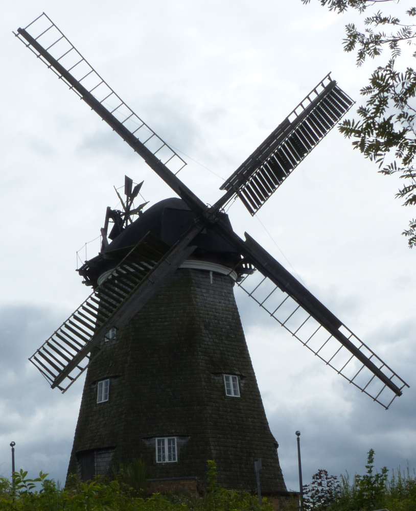

to this awesome Lithophane

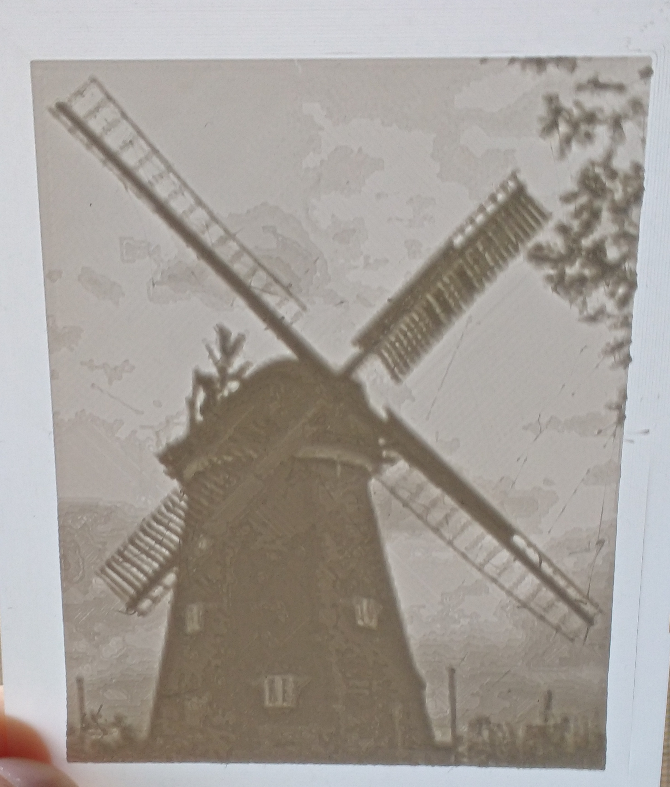

1. If not installed already go to [https://www.freecadweb.org/](https://www.freecadweb.org/) and grab yourself a fresh copy of FreeCAD and install it.
    - FreeCAD is a AWESOME free 3D CAD parametric modeling application.
    - Don't worry. You don't need to know much about 3D modelling to get a nice looking Lithophane out of this tool.

2. Install the Lithophane Workbench. The workbench is available in the addon manager. The addon manager can be found in the ``Tools`` menu. Locate the "Lithophane" entry and click Install.

3. Switch to the Lithophane workbench in FreeCAD
    - 

4. Click the "Import Image" button 
    - 
    - A file selector will be shown. Select the image and click "Open"
    - Depending on the image and your machine, it might take a while for the import to finish. On my 8 years old Intel i7-2670QM it takes about 8 seconds to import the windmill image (814x1000 pixels)
    - **FreeCAD might be unresponsive during the import**

5. Switch to the TreeView and select the imported image
    - 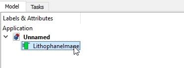

6. Click the "Create Box" button
    - 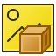
    - Depending on the image and your machine it might take a while to compute the geometry. On my machine the testimage needed about 2 Seconds to compute.
    - **FreeCAD might be unresponsive during the import**

7. Now you should see the image in the TreeView and the Viewport. You can pan and zoom to look on the image from different sides.
    - See [Mouse Model](https://www.freecadweb.org/wiki/Mouse_Model) for more information on how to navigate in FreeCADs 3D View

8. Select the generated mesh in the TreeView and click on `File -> Export`. Choose `STL Mesh` (Or anything your slicer software could handle) as file format and save the file somewhere on your machine.
    - 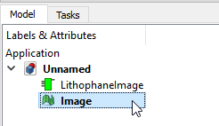

9. Fire Up your slicer (e.g. Cura) and load the exported file. Adapt the settings according to your 3D Printer and save the gcode. Load the gcode in your printer and let it print. This might take some hours to finish.

10. Have fun with your nice Lithophane image :)
</details>

## Command Details

<details>
<summary>
This section describes each command in the workbench.
</summary>

### Import Image


The command imports a new Image into the document. Therefore a Dialog is shown that let you select an image. After the image is selected it calculates the Point cloud from the pixel data of the image.

Depending on the image and your machine, it might take a while for the import to finish. On my 8 years old Intel i7-2670QM it takes about 8 seconds to import the windmill image (814x1000 pixels). **FreeCAD might be unresponsive during the import**.

The name of the imported image object will be taken from the image file.

The image is also shown in the 3D View. The image is converted to grayscale and the size is the same as the final geometry created with the `Create Box` command. So you get a feeling for the final geometry even before creating it. The image is displayed 1 mm beneath the XY Plane. This makes it possible to trace over the image when needed. You can even select the image in the 3D view by clicking on it.

To hide or show the image in the 3D view, select it and hit `Space`.

**The pixel data whil be computed every time you recompute the image object!** This can happen when you change some settings of the image or force a recompute of the whole document.
For performance reasons the calculated point cloud is stored inside the FreeCAD file. So your files can get pretty big real fast when you import big images.

#### Transparency

If a pixel has a alpha value of less than 255, the alpha value will be used to calculate the height of the pixel. A alpha value of 0 means the base height and 254 means the full height. Everything between will be calculated accordingly.

#### Image properties

The imported image has some properties that affect the final result. All this properties have some reasonable defaults. But feel free to change them if needed.

You find the properties in the `Data` tab of the properties editor, when the LithophaneImage is selected in the tree view.
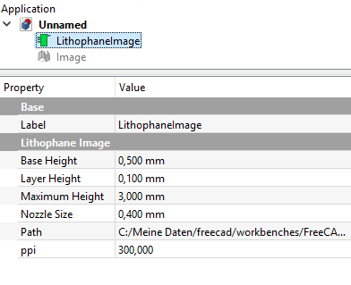

**Base Height / Maximum Height**

These two properties define the height of the resulting geometry based on the lightning information of the image. Fully white parts of the image will result in the base height, fully black parts will map to the maximum height and everything else will be mapped to height values in between. Depending on the filament used to print your image you might want to adjust the values slightly.

**Layer Height**

3D Printers have a finite resolution on the Z Axis. The best my printer can print are layers of 0.1 mm in height. Based on the color of a pixel we can end up with a point at 0.05324 mm in Z direction. The 3D Printer is not able to print this. So we shift the point up or down to the nearest multiple of the given layer height.

This value should be set to the layer height you select in your slicer software. It can be set to 0 to get the raw height values based on the color information.

**Nozzle Size**

The nozzle of the 3D Printer defines how wide a line the printer prints will end up. Based on the image size we might end up with a huge amount of points, that might be impossible to handle for FreeCAD. Based on the dpi settings we might end up with points every 0.0something mm in X and Y direction. So we calculate the average of all the points in a `Nozzle Size`x`Nozzle Size` area to reduce the number of points drastically.

This value should match the nozzle size of your 3D Printer. It can be set to 0 to get the raw pixel data without averaging neighbour pixels. As said before. This can freeze your FreeCAD installation for a long time or crash it.

**Path**

The Path to the image file. You can change it to another image here if you want or simply import another image with the `Import Image` command.

**ppi**

The number of image pixels that will end up in one inch of the resulting geometry. Higher values normally result in more details in the final image. This property basically affects the size of the final geometry.

See `Scale Image` for a command that helps you adjusting this value.

### Create Box


Creates the Lithophane geometry in the shape of a box with the image on top of it. You have to select the LithophaneImage in the TreeView before executing the command.

The name of the resulting mesh will be taken from the selected LithophaneImage. When the selected image is named `Windmill` the resulting mesh will be named `Windmill_Box`.

See `Boolean Mesh` for more informations on the genereated object.

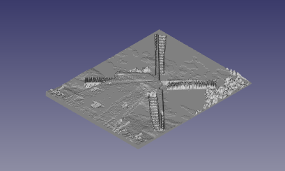

More Features might follow: https://github.com/furti/FreeCAD-Lithophane/issues/15

### Create Tube / Cylinder
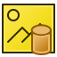

Creates the Lithophane geometry in the shape of a Tube or Cylinder with the image wraped around. You have to select the LithophaneImage in the TreeView before executing the command.

The name of the resulting mesh will be taken from the selected LithophaneImage. When the selected image is named `Windmill` the resulting mesh will be named `Windmill_Tube`.

See `Boolean Mesh` for more informations on the genereated object.

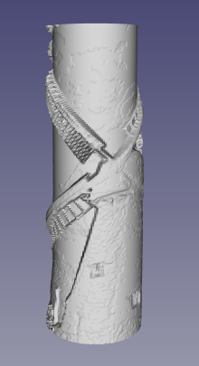

### Scale Image


This command can be used to scale the selected LithophaneImage. When executed, a task dialog will be shown.

- OK will apply the new size to the image (Recompution might take a while)
 - Cancel will simply close the dialog and nothing will be applied

The command has 3 different modes of operation:

#### Scale Length/Width of image

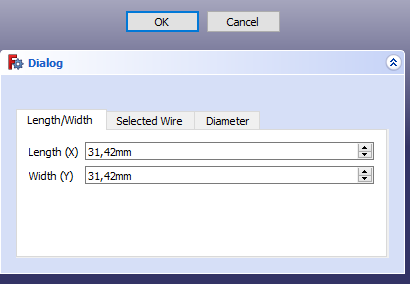

You can enter either the new length or width of the image. Entering one value will adjust the other value accordingly.


#### Scale by selected Wire

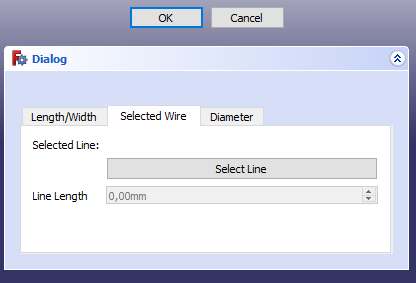

You can draw a draft Line in the 3D View. Select it and click the `Select Line` button. This will enable the Line Length input field. You can enter a new length here and the image size will be changed accordingly. This is especially useful when you want to scale some object in the image to a specific size. e.g. there is a line in the image you want to have 10mm wide.

#### Scale by Diameter

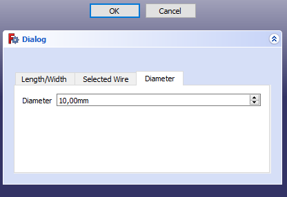

This mode is especially useful when creating cylindrical lithophanes and you want to scale the image to fit a certain diameter. Simply put the diameter in the input box and the length and width of the image will be adjusted accordingly.

### Make Solid


Converts the Mesh selected to a solid. Should only be used with meshes created by the Lithophane Workbench because this command makes some assumptions on the structure of the mesh to speed up mesh creation. You have to select a single Mesh in the TreeView for this command to work.

**This command can take a long time and freeze your FreeCAD instance**.

This command might be handy to convert your mesh and use the power of FreeCAD to modify the resulting Lithophane the way you want.

### Measure Size


Displays a Dialog with Length (in X direction), Width (in Y direction) and Height (in Z direction) of the selected Mesh. You have to select a Mesh in the TreeView for this command to work. It should work not only with Meshes created by the Lithophane Workbench but with all kind of Meshes in the document.

The command respects your unit and decimal preferences.

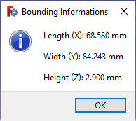

### Show Pointcloud
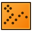

Displays all the Points the LithophaneImage contains in the 3D View. You have to select a LithophaneImage for this command to work.

This command might be useful for debugging purposes to check if the pixel data was interpreted as you imagine.

### Cancel Task


Cancels the current running operation. The operation will not be canceled immediately but after the current step is finished.

This is useful for cancelling long running tasks (e.g. you imported a way to big image).

### Boolean Add


Adds an additive Boolean Feature to the selected Boolean Mesh.

To use this command you have to select a Boolean Mesh and a base feature. The base feature can either be a FreeCAD Mesh object or anything that has a valid Shape property. It does not matter in what order you select the two objects.

See `Boolean Mesh` for more informations.

### Boolean Subtract


Adds an subtractive Boolean Feature to the selected Boolean Mesh.

To use this command you have to select a Boolean Mesh and a base feature. The base feature can either be a FreeCAD Mesh object or anything that has a valid Shape property. It does not matter in what order you select the two objects.

See `Boolean Mesh` for more informations.

</details>

## Boolean Mesh

A Boolean Mesh is a FreeCAD Object that builds a Mesh from a linked LithophaneImage. Additionally one can apply boolean operations to the generated mesh. This boolean Operations behave similar to features in a PartDesign Object. They are applied in order they are added to the Boolean Mesh.

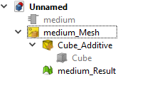

The following Boolean Operations are currently available:
 - **Add**: Adds the base features geometry to the mesh
 - **Subtract**: Subtracts the base features geometry from the mesh

The Boolean Mesh also has a Mesh called "Result" linked to it. This is always the last child displayed in the Tree View. This holds the final geometry when all boolean operations are applied to the Mesh generated from the Lithophane Image.

A Boolean Operation has the following properties:
 - **Base**: The Object that is used to generate the geometry for addition or substraction. Can be a Mesh or something that has a Shape.
 - **Enabled**: When set to true the operation will be applied. When set to false the operation will be skipped.
 - **Mode**: The mode (Add, Subtract) the operation is working in.

See https://furti.github.io/FreeCAD-Lithophane/#boolean_showcase for a demo.

To apply Boolean Operations to a mesh you either have to install ```OpenSCAD``` or ```Blender``` and configure one of them in FreeCAD.

### OpenSCAD
If you want to use OpenSCAD for Boolean Operations, switch to the ```OpenSCAD``` Workbench and go to ```Edti > Preferences > OpenSCAD``` and set the ```OpenSCAD executable``` path.

OpenSCAD has some Performance limitations when used on bigger meshes. So use this with caution.

### Blender
If you want to use Blender for Boolean Operations, go to ```Tools > Edit Parameters``` and select ```Plugins > Furti > Lithophane```. Set ```BlenderExecutable``` to your Blender installation and ```UseBlenderForBooleanOperations``` to true.

Blender is a lot faster than OpenSCAD when it comes to Boolean operations.

## Progress Indicator

Commands that might take a while to recompute display a progress indicator in the bottom right corner of the FreeCAD window. So you can guess how long the command might take to finish.
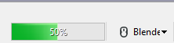

It is possible to cancel a long running task. See ```Cancel Task``` in the ```Command Details``` section.

## Image Viewer

The workbench comes with a basic image viewer embedded. Simply double click on a LithophaneImage to display the image in a modal dialog.

## Compatibility
The Workbench should be compatible with the following FreeCAD Versions (at least on Windows):
 - 0.17
 - 0.18
 - 0.18 (Py3/QT5)

## Dependencies
The Workbench does not need any additional software to be installed to be fully functional.

The only exception could be a image manipulation program. This could be handy to change some aspects of the image like contrast or size before creating a Lithophane from it.

## Support
Found a bug? Have a nice feature request? Post to this FreeCAD Forum thread https://forum.freecadweb.org/viewtopic.php?f=9&t=30496 or simply create an issue in this repository.

## Limitations
 - Only tested on Windows 10 right now
 - Not tested with a lot of different images and image formats
 - Make Solid has some performance issues for bigger images and the created part is not a actual solid :(
